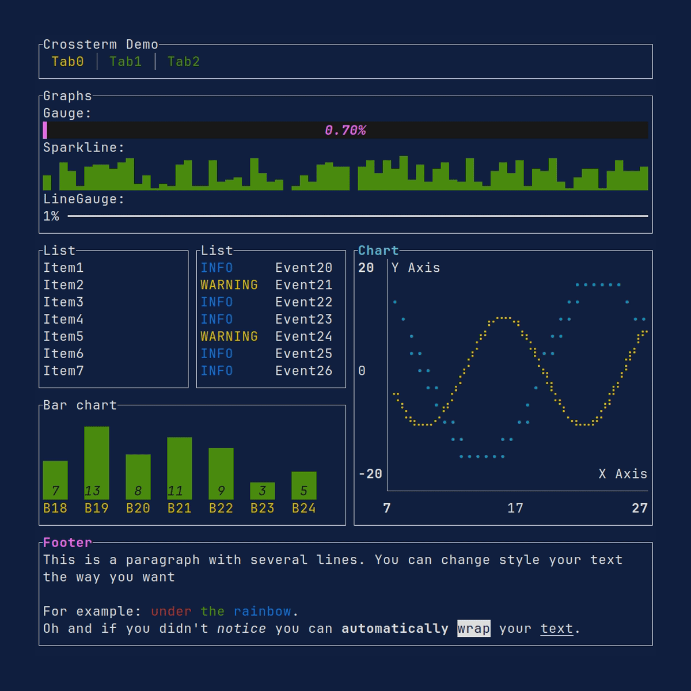
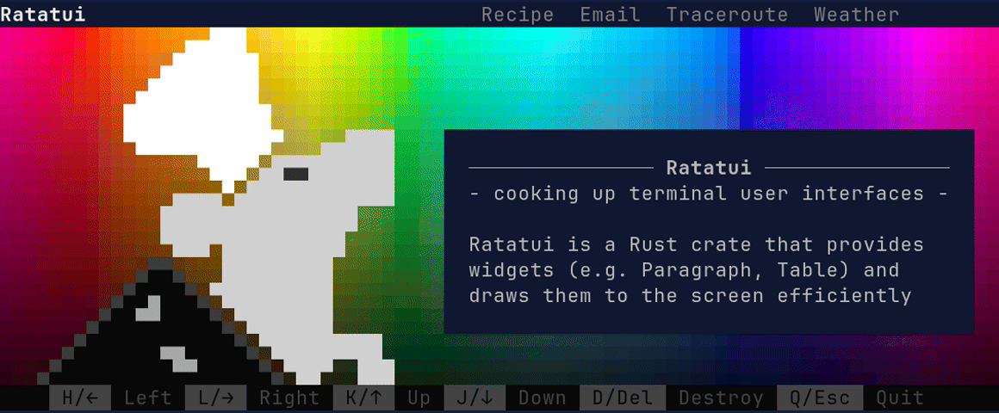

# Examples

This folder contains examples that are more application focused.
There are also [widget examples] in `ratatui-widgets`.

[widget examples]: ../ratatui-widgets/examples

You can run these examples using:

```shell
cargo run -p example-name
```

This folder might use unreleased code. Consider viewing the examples in the `latest` branch instead
of the `main` branch for code which is guaranteed to work with the released ratatui version.

> [!WARNING]
>
> There may be backwards incompatible changes in these examples, as they are designed to compile
> against the `main` branch.
>
> There are a few workaround for this problem:
>
> - View the examples as they were when the latest version was release by selecting the tag that
>   matches that version. E.g. <https://github.com/ratatui/ratatui/tree/v0.26.1/examples>.
> - If you're viewing this file on GitHub, there is a combo box at the top of this page which
>   allows you to select any previous tagged version.
> - To view the code locally, checkout the tag. E.g. `git switch --detach v0.26.1`.
> - Use the latest [alpha version of Ratatui] in your app. These are released weekly on Saturdays.
> - Compile your code against the main branch either locally by adding e.g. `path = "../ratatui"` to
>   the dependency, or remotely by adding `git = "https://github.com/ratatui/ratatui"`
>
> For a list of unreleased breaking changes, see [BREAKING-CHANGES.md].
>
> We don't keep the CHANGELOG updated with unreleased changes, check the git commit history or run
> `git-cliff -u` against a cloned version of this repository.

## Design choices

The examples contain some opinionated choices in order to make it easier for newer rustaceans to
easily be productive in creating applications:

- Each example has an `App` struct, with methods that implement a main loop, handle events and drawing
  the UI.
- We use `color_eyre` for handling errors and panics. See [How to use color-eyre with Ratatui] on the
  website for more information about this.
- Common code is not extracted into a separate file. This makes each example self-contained and easy
  to read as a whole.

[How to use color-eyre with Ratatui]: https://ratatui.rs/recipes/apps/color-eyre/

## Demo

This is the original demo example from the main README. It is available for each of the backends.
[Source](./apps/demo/).



## Demo2

This is the demo example from the main README and crate page. [Source](./apps/demo2/).



## Async GitHub

Shows how to fetch data from GitHub API asynchronously. [Source](./apps/async-github/).

![Async GitHub demo][async-github.gif]

## Calendar Explorer

Shows how to render a calendar with different styles. [Source](./apps/calendar-explorer/).

![Calendar explorer demo][calendar-explorer.gif]

## Canvas

Shows how to render a canvas with different shapes. [Source](./apps/canvas/).

![Canvas demo][canvas.gif]

## Chart

Shows how to render line, bar, and scatter charts. [Source](./apps/chart/).

![Chart demo][chart.gif]

## Color Explorer

Shows how to handle the supported colors. [Source](./apps/color-explorer/).

![Color explorer demo][color-explorer.gif]

## Colors-RGB demo

Shows the full range of RGB colors in an animation. [Source](./apps/colors-rgb/).

![Colors-RGB demo][colors-rgb.gif]

## Constraint Explorer

Shows how different constraints can be used to layout widgets. [Source](./apps/constraint-explorer/).

![Constraint Explorer demo][constraint-explorer.gif]

## Constraints

Shows different types of constraints. [Source](./apps/constraints/).

![Constraints demo][constraints.gif]

## Custom Widget

Shows how to create a custom widget that can be interacted with the mouse. [Source](./apps/custom-widget/).

![Custom widget demo][custom-widget.gif]

## Hyperlink

Shows how to render hyperlinks in a terminal using [OSC
8](https://gist.github.com/egmontkob/eb114294efbcd5adb1944c9f3cb5feda). [Source](./apps/hyperlink/).

![Hyperlink demo][hyperlink.gif]

## Flex

Shows how to use the flex layouts. [Source](./apps/flex/).

![Flex demo][flex.gif]

## Hello World

Shows how to create a simple TUI with a text. [Source](./apps/hello-world/).

![Hello World demo][hello-world.gif]

## Gauge

Shows different types of gauges. [Source](./apps/gauge/).

## Inline

Shows how to use the inlined viewport to render in a specific area of the screen. [Source](./apps/inline/).

![Inline demo][inline.gif]

## Input Form

Shows how to render a form with input fields. [Source](./apps/input-form/).

## Modifiers

Shows different types of modifiers. [Source](./apps/modifiers/).

![Modifiers demo][modifiers.gif]

## Mouse Drawing

Shows how to handle mouse events. [Source](./apps/mouse-drawing/).

## Minimal

Shows how to create a minimal application. [Source](./apps/minimal/).

![Minimal demo][minimal.gif]

## Panic

Shows how to handle panics. [Source](./apps/panic/).

![Panic demo][panic.gif]

## Popup

Shows how to handle popups. [Source](./apps/popup/).

![Popup demo][popup.gif]

## Scrollbar

Shows how to render different types of scrollbars. [Source](./apps/scrollbar/).

![Scrollbar demo][scrollbar.gif]

## Table

Shows how to create an interactive table. [Source](./apps/table/).

![Table demo][table.gif]

## Todo List

Shows how to create a simple todo list application. [Source](./apps/todo-list/).

![Todo List demo][todo-list.gif]

## Tracing

Shows how to use the [tracing](https://crates.io/crates/tracing) crate to log to a file. [Source](./apps/tracing/).

![Tracing demo][tracing.gif]

## User Input

Shows how to handle user input. [Source](./apps/user-input/). [Source](./apps/user-input/).

![User input demo][user-input.gif]

## Weather

Shows how to render weather data using barchart widget. [Source](./apps/weather/).

## WidgetRef Container

Shows how to use [`WidgetRef`](https://docs.rs/ratatui/latest/ratatui/widgets/trait.WidgetRef.html) to store widgets in a container. [Source](./apps/widget-ref-container/).

## Advanced Widget Implementation

Shows how to render the `Widget` trait in different ways.

![Advanced widget impl demo][advanced-widget-impl.gif]

---

<details>
  <summary>How to update these examples?</summary>

These gifs were created using [VHS](https://github.com/charmbracelet/vhs). Each example has a
corresponding `.tape` file that holds instructions for how to generate the images. Note that the
images themselves are stored in a separate `images` git branch to avoid bloating the `main`
branch.

<!--

Links to images to make them easier to update in bulk. Use the following script to update and upload
the examples to the images branch. (Requires push access to the branch).

```shell
vhs/generate.bash
```
-->

</details>

[advanced-widget-impl.gif]: https://github.com/ratatui/ratatui/blob/images/examples/advanced-widget-impl.gif?raw=true
[async-github.gif]: https://github.com/ratatui/ratatui/blob/images/examples/async-github.gif?raw=true
[calendar-explorer.gif]: https://github.com/ratatui/ratatui/blob/images/examples/calendar-explorer.gif?raw=true
[canvas.gif]: https://github.com/ratatui/ratatui/blob/images/examples/canvas.gif?raw=true
[chart.gif]: https://github.com/ratatui/ratatui/blob/images/examples/chart.gif?raw=true
[color-explorer.gif]: https://github.com/ratatui/ratatui/blob/images/examples/color-explorer.gif?raw=true
[colors-rgb.gif]: https://github.com/ratatui/ratatui/blob/images/examples/colors-rgb.gif?raw=true
[constraint-explorer.gif]: https://github.com/ratatui/ratatui/blob/images/examples/constraint-explorer.gif?raw=true
[constraints.gif]: https://github.com/ratatui/ratatui/blob/images/examples/constraints.gif?raw=true
[custom-widget.gif]: https://github.com/ratatui/ratatui/blob/images/examples/custom-widget.gif?raw=true
[demo2-destroy.gif]: https://github.com/ratatui/ratatui/blob/images/examples/demo2-destroy.gif?raw=true
[demo2-social.gif]: https://github.com/ratatui/ratatui/blob/images/examples/demo2-social.gif?raw=true
[demo2.gif]: https://github.com/ratatui/ratatui/blob/images/examples/demo2.gif?raw=true
[demo.gif]: https://github.com/ratatui/ratatui/blob/images/examples/demo.gif?raw=true
[flex.gif]: https://github.com/ratatui/ratatui/blob/images/examples/flex.gif?raw=true
[hello-world.gif]: https://github.com/ratatui/ratatui/blob/images/examples/hello-world.gif?raw=true
[hyperlink.gif]: https://github.com/ratatui/ratatui/blob/images/examples/hyperlink.gif?raw=true
[inline.gif]: https://github.com/ratatui/ratatui/blob/images/examples/inline.gif?raw=true
[minimal.gif]: https://github.com/ratatui/ratatui/blob/images/examples/minimal.gif?raw=true
[modifiers.gif]: https://github.com/ratatui/ratatui/blob/images/examples/modifiers.gif?raw=true
[panic.gif]: https://github.com/ratatui/ratatui/blob/images/examples/panic.gif?raw=true
[popup.gif]: https://github.com/ratatui/ratatui/blob/images/examples/popup.gif?raw=true
[scrollbar.gif]: https://github.com/ratatui/ratatui/blob/images/examples/scrollbar.gif?raw=true
[table.gif]: https://github.com/ratatui/ratatui/blob/images/examples/table.gif?raw=true
[todo-list.gif]: https://github.com/ratatui/ratatui/blob/images/examples/todo-list.gif?raw=true
[tracing.gif]: https://github.com/ratatui/ratatui/blob/images/examples/tracing.gif?raw=true
[user-input.gif]: https://github.com/ratatui/ratatui/blob/images/examples/user-input.gif?raw=true
